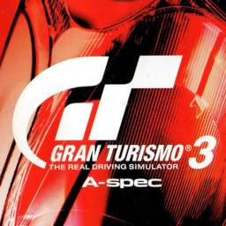

# Gran Turismo 3: A-Spec

## PS2 Saves - SCES50294

| Icon | Filename | Description |
|------|----------|-------------|
|  | [00000001.zip](00000001.zip){: .btn .btn-purple } | Every single car in garage with all available parts and upgrades purchased, gold in all licence tests, game 100% Completed |
|  | [00000011.zip](00000011.zip){: .btn .btn-purple } | BESCES-50294GAMEDATA: Donnees de Jeu GT3 (357_Donnees_de_721630.max) |
|  | [00000002.zip](00000002.zip){: .btn .btn-purple } | BESCES-50294GAMEDATA: GT3 Spieldaten (184_GT3_Spield_173794.max) |
|  | [00000003.zip](00000003.zip){: .btn .btn-purple } | BESCES-50294RCBMwg2F: GT3 WiederholungARSOUILLE (364_GT3_REPLAY_272595.max) |
|  | [00000004.zip](00000004.zip){: .btn .btn-purple } | BESCES-50294BiD1IZYa: Ral. Permis GT3AP (357_Ral__Permi_273816.max) |
|  | [00000005.zip](00000005.zip){: .btn .btn-purple } | BESCES-50294GAMEDATA: Dati di gioco GT3 (406_GT3_100_10_706646.max) |
|  | [00000006.zip](00000006.zip){: .btn .btn-purple } | BESCES-50294GAMEDATA: GT3 Spieldaten (125_GT3_Spield_797665.max) |
|  | [00000007.zip](00000007.zip){: .btn .btn-purple } | BESCES-50294RrBwIA5Q: GT3 WiederholungCOOL (402_GT3_Wieder_443142.max) |
|  | [00000008.zip](00000008.zip){: .btn .btn-purple } | BESCES-50294GAMEDATA: GT3 Spieldaten (305_GT3_Spield_572598.max) |
