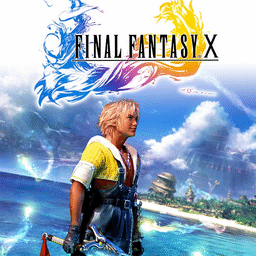

# Final Fantasy X

## PS2 Saves - SCES50492

| Icon | Filename | Description |
|------|----------|-------------|
|  | [00000001.zip](00000001.zip){: .btn .btn-purple } | BESCES-50492FF090602: FF10 [03]  29:44SIN Totenturm (1_FF10__03___225323.max) |
|  | [00000002.zip](00000002.zip){: .btn .btn-purple } | BESCES-50492FF090600: FF10 [01] 288:57Monsteranstalt (382_FF10__01___118924.max) |
|  | [00000003.zip](00000003.zip){: .btn .btn-purple } | BESCES-50492FF090602: FF10 [03]  26:23BEV.Bruecke (246_FF10__03___285366.max) |
|  | [00000004.zip](00000004.zip){: .btn .btn-purple } | BESCES-50492FF090601: FF10 [02]  42:44SIN Totenturm (913_FF10__02___385907.max) |
|  | [00000005.zip](00000005.zip){: .btn .btn-purple } | BESCES-50492FF090603: FF10 [04]  67:56Flug Bruecke (1574_FF10__04___745357.max) |
|  | [00000006.zip](00000006.zip){: .btn .btn-purple } | BESCES-50492FF090600: FF10 [01] 288:57Monsteranstalt (1_FF10__01___308590.max) |
|  | [00000007.zip](00000007.zip){: .btn .btn-purple } | BESCES-50492FF090602: FF10 [03]  29:44SIN Totenturm (1_FF10__03___193676.max) |
|  | [00000008.zip](00000008.zip){: .btn .btn-purple } | BESCES-50492FF090602: FF10 [03]  29:44SIN Totenturm (1_FF10__03___634502.max) |
|  | [00000009.zip](00000009.zip){: .btn .btn-purple } | BESCES-50492FF090600: FF10 [01] 215:01Monsteranstalt (1830_FF10__01___609554.max) |
