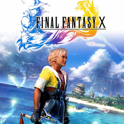

# Final Fantasy X

## PS2 Saves - SCES50493

| Icon | Filename | Description |
|------|----------|-------------|
|  | [00000001.zip](00000001.zip){: .btn .btn-purple } | BESCES-50493FF090603: FF10 [04] 112:50Piana b./zoolab (1_FF10__04___191647.max) |
|  | [00000002.zip](00000002.zip){: .btn .btn-purple } | BESCES-50493FF090603: FF10 [04] 112:50Piana b./zoolab (1_FF10__04___717907.max) |
|  | [00000003.zip](00000003.zip){: .btn .btn-purple } | BESCES-50493FF090602: FF10 [03]  70:47Aeronave/ponte (2872_FF10__03___284832.max) |
|  | [00000004.zip](00000004.zip){: .btn .btn-purple } | BESCES-50493FF090603: FF10 [04] 112:50Piana b./zoolab (1_FF10__04___146344.max) |
|  | [00000005.zip](00000005.zip){: .btn .btn-purple } | BESCES-50493FF090600: FF10 [01]  19:30Fluvilunio/nord (1_FF10__01___400250.max) |
|  | [00000006.zip](00000006.zip){: .btn .btn-purple } | BESCES-50493FF090600: FF10 [01]  19:30Fluvilunio/nord (1_FF10__01___916134.max) |
|  | [00000007.zip](00000007.zip){: .btn .btn-purple } | BESCES-50493FF090603: FF10 [04] 112:50Piana b./zoolab (1_FF10__04___112988.max) |
