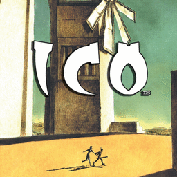

# Ico

## PS2 Saves - SCES50760

| Icon | Filename | Description |
|------|----------|-------------|
|  | [00000001.zip](00000001.zip){: .btn .btn-purple } | BESCES-50760ico: ICO (9661_ICO_254498.max) |
|  | [00000002.zip](00000002.zip){: .btn .btn-purple } | BESCES-50760ico: ICO (1_ICO_504910.max) |
|  | [00000003.zip](00000003.zip){: .btn .btn-purple } | BESCES-50760ico: ICO (0_Ico_Powers_943340.max) |
|  | [00000004.zip](00000004.zip){: .btn .btn-purple } | BESCES-50760ico: ICO (3035_ICO_705257.max) |
|  | [00000005.zip](00000005.zip){: .btn .btn-purple } | BESCES-50760ico: ICO (1_ICO_555340.max) |
