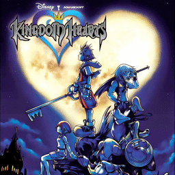

# Kingdom Hearts

## PS2 Saves - SCES50967

| Icon | Filename | Description |
|------|----------|-------------|
|  | [00000001.zip](00000001.zip){: .btn .btn-purple } | BESCES-50967-14: KINGDOMHEARTS/14World Terminus (0_Kingdom_He_621731.max) |
|  | [00000002.zip](00000002.zip){: .btn .btn-purple } | BESCES-50967-12: KINGDOMHEARTS/12Library (0_Kingdom_He_866222.max) |
|  | [00000003.zip](00000003.zip){: .btn .btn-purple } | BESCES-50967-13: KINGDOMHEARTS/13Clock Tower (0_Kingdom_He_817913.max) |
|  | [00000100.zip](00000100.zip){: .btn .btn-purple } | Monstro Complete. |
|  | [00000101.zip](00000101.zip){: .btn .btn-purple } | Start Of Traverse Town 1. |
|  | [00000102.zip](00000102.zip){: .btn .btn-purple } | Wonderland Complete. |
|  | [00000103.zip](00000103.zip){: .btn .btn-purple } | Traverse Town 1 Complete. |
|  | [00000104.zip](00000104.zip){: .btn .btn-purple } | Traverse Town 2 Complete. |
|  | [00000105.zip](00000105.zip){: .btn .btn-purple } | Agrobah Complete. |
|  | [00000106.zip](00000106.zip){: .btn .btn-purple } | Olympus Complete. |
|  | [00000107.zip](00000107.zip){: .btn .btn-purple } | Jungle Complete. |
|  | [00000108.zip](00000108.zip){: .btn .btn-purple } | Before Final Bosses. |
|  | [00000109.zip](00000109.zip){: .btn .btn-purple } | Neverland Complete. |
|  | [00000110.zip](00000110.zip){: .btn .btn-purple } | Halloween Town Complete. |
|  | [00000111.zip](00000111.zip){: .btn .btn-purple } | Hollow Bastian Complete. |
|  | [00000112.zip](00000112.zip){: .btn .btn-purple } | All Side Quests Complete. |
