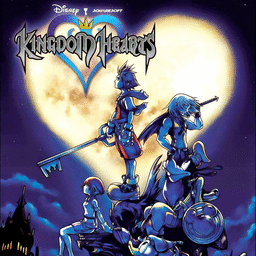

# Kingdom Hearts

## PS2 Saves - SCES50969

| Icon | Filename | Description |
|------|----------|-------------|
|  | [00000001.zip](00000001.zip){: .btn .btn-purple } | BESCES-50969-04: KINGDOM  HEARTSyM04N LV019 16:53 (1_KINGDOM__H_635220.max) |
|  | [00000002.zip](00000002.zip){: .btn .btn-purple } | BESCES-50969-01: KINGDOM  HEARTS [01] LV100 00:3 (4847_KINGDOM_HE_674328.max) |
|  | [00000003.zip](00000003.zip){: .btn .btn-purple } | BESCES-50969-03: KINGDOM  HEARTS [03] LV100 42:1 (6994_KINGDOM_HE_521160.max) |
|  | [00000004.zip](00000004.zip){: .btn .btn-purple } | BESCES-50969-01: KINGDOM  HEARTS (1586_KINGDOM_HE_379406.max) |
|  | [00000005.zip](00000005.zip){: .btn .btn-purple } | BESCES-50969-02: KINGDOM  HEARTS (5167_KINGDOM_HE_498196.max) |
|  | [00000006.zip](00000006.zip){: .btn .btn-purple } | BESCES-50969-99: KINGDOM  HEARTS [99] LV089 73:2 (1_KINGDOM__H_52167.max) |
|  | [00000007.zip](00000007.zip){: .btn .btn-purple } | BESCES-50969-01: KINGDOM  HEARTS [01] LV083 38:2 (5298_KINGDOM_HE_641460.max) |
|  | [00000008.zip](00000008.zip){: .btn .btn-purple } | BESCES-50969-02: KINGDOM  HEARTS [02] LV100 42:3 (6523_KINGDOM_HE_246884.max) |
