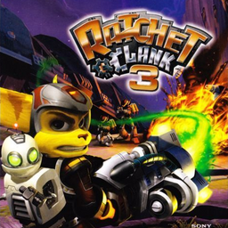

# Ratchet & Clank 3

## PS2 Saves - SCES52456

| Icon | Filename | Description |
|------|----------|-------------|
|  | [00000001.zip](00000001.zip){: .btn .btn-purple } | BESCES-52456RATCHET: Ratchet & Clank     3           (4849_Ratchet____749279.max) |
|  | [00000002.zip](00000002.zip){: .btn .btn-purple } | BESCES-52456RATCHET: Ratchet & Clank     3           (3563_Ratchet____52014.max) |
|  | [00000003.zip](00000003.zip){: .btn .btn-purple } | BESCES-52456RATCHET: Ratchet & Clank     3           (2896_Ratchet____381253.max) |
|  | [00000004.zip](00000004.zip){: .btn .btn-purple } | BESCES-52456RATCHET: Ratchet & Clank     3           (4849_Ratchet____895153.max) |
|  | [00000005.zip](00000005.zip){: .btn .btn-purple } | BESCES-52456RATCHET: Ratchet & Clank     3           (7229_Ratchet____938518.max) |
|  | [00000006.zip](00000006.zip){: .btn .btn-purple } | BESCES-52456RATCHET: Ratchet & Clank     3           (8384_Ratchet____660213.max) |
|  | [00000007.zip](00000007.zip){: .btn .btn-purple } | BESCES-52456RATCHET: Ratchet & Clank     3           (2249_Ratchet____280087.max) |
|  | [00000008.zip](00000008.zip){: .btn .btn-purple } | BESCES-52456RATCHET: Ratchet & Clank     3           (3091_Ratchet____864727.max) |
|  | [00000009.zip](00000009.zip){: .btn .btn-purple } | BESCES-52456RATCHET: Ratchet & Clank     3           (7993_Ratchet____853237.max) |
|  | [00000010.zip](00000010.zip){: .btn .btn-purple } | BESCES-52456RATCHET: Ratchet & Clank     3           (7993_Ratchet____31460.max) |
