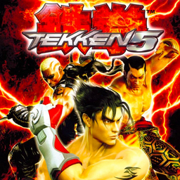

# Tekken 5

## PS2 Saves - SCES53202

| Icon | Filename | Description |
|------|----------|-------------|
|  | [00000001.zip](00000001.zip){: .btn .btn-purple } | BESCES-53202: TEKKEN 5 (6414_TEKKEN_5_613094.max) |
|  | [00000002.zip](00000002.zip){: .btn .btn-purple } | BESCES-53202: TEKKEN 5 (3508_TEKKEN_5_665630.max) |
|  | [00000003.zip](00000003.zip){: .btn .btn-purple } | BESCES-53202: TEKKEN 5 (3452_TEKKEN_5_1_190762.max) |
|  | [00000004.zip](00000004.zip){: .btn .btn-purple } | BESCES-53202: TEKKEN 5 (4083_TEKKEN_5_894375.max) |
|  | [00000005.zip](00000005.zip){: .btn .btn-purple } | BESCES-53202: TEKKEN 5 (843_TEKKEN_5_685589.max) |
|  | [00000006.zip](00000006.zip){: .btn .btn-purple } | BESCES-53202: TEKKEN 5 (4281_TEKKEN_5_527279.max) |
|  | [00000007.zip](00000007.zip){: .btn .btn-purple } | BESCES-53202: TEKKEN 5 (4649_TEKKEN_5_313839.max) |
|  | [00000008.zip](00000008.zip){: .btn .btn-purple } | BESCES-53202: TEKKEN 5 (4585_TEKKEN_5_823452.max) |
|  | [00000009.zip](00000009.zip){: .btn .btn-purple } | BESCES-53202: TEKKEN 5 (6053_TEKKEN_5_194455.max) |
|  | [00000010.zip](00000010.zip){: .btn .btn-purple } | BESCES-53202: TEKKEN 5 (6657_TEKKEN_5_549954.max) |
