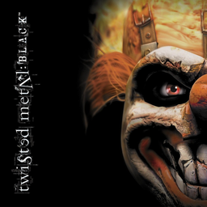

# Twisted Metal: Black

## PS2 Saves - SCUS97101

| Icon | Filename | Description |
|------|----------|-------------|
|  | [00000001.zip](00000001.zip){: .btn .btn-purple } | BASCUS-97101: TM Black (3995_TM_Black_863903.max) |
|  | [00000002.zip](00000002.zip){: .btn .btn-purple } | BASCUS-97101: TM Black (1_TM_Black_13272.max) |
|  | [00000003.zip](00000003.zip){: .btn .btn-purple } | BASCUS-97101: TM Black (2283_TM_Black_407284.max) |
|  | [00000004.zip](00000004.zip){: .btn .btn-purple } | BASCUS-97101: TM Black (7069_TM_Black_1_445736.max) |
|  | [00000005.zip](00000005.zip){: .btn .btn-purple } | BASCUS-97101: TM Black (9343_TM_Black_578396.max) |
|  | [00000006.zip](00000006.zip){: .btn .btn-purple } | BASCUS-97101: Peter (1_Peter_248318.max) |
|  | [00000007.zip](00000007.zip){: .btn .btn-purple } | BASCUS-97101: TM Black (6216_Twisted_Me_484600.max) |
