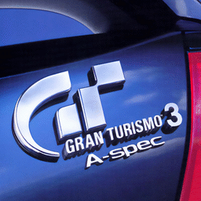

# Gran Turismo 3: A-Spec

## PS2 Saves - SCUS97102

| Icon | Filename | Description |
|------|----------|-------------|
|  | [00000001.zip](00000001.zip){: .btn .btn-purple } | BASCUS-97102BPDHgASb: GT3 BEST LAPMaTT (7565_GT3_BEST_L_908733.max) |
|  | [00000002.zip](00000002.zip){: .btn .btn-purple } | BASCUS-97102RADspArA: GT3 REPLAY DATAFishtail AI (2421_GT3_REPLAY_736690.max) |
|  | [00000003.zip](00000003.zip){: .btn .btn-purple } | BASCUS-97102GAMEDATA: GT3 GAME DATA (2715_GT3_Money__202694.max) |
|  | [00000004.zip](00000004.zip){: .btn .btn-purple } | BASCUS-97102B8AQgABF: GT3 BEST LAPDrifting 303-A (9946_GT3_BEST_L_893017.max) |
|  | [00000005.zip](00000005.zip){: .btn .btn-purple } | BASCUS-97102GAMEDATA: GT3 GAME DATA (1_GT3_GAME_D_458386.max) |
|  | [00000006.zip](00000006.zip){: .btn .btn-purple } | BASCUS-97102GAMEDATA: GT3 GAME DATA (6605_Gran_Turis_627682.max) |
|  | [00000007.zip](00000007.zip){: .btn .btn-purple } | BASCUS-97102B6CQgAbC: GT3 BEST LAPCivic drifting2 (6605_Civic_drif_859829.max) |
|  | [00000008.zip](00000008.zip){: .btn .btn-purple } | BASCUS-97102BTDwgA4t: GT3 BEST LAPsilvia (1_GT3_BEST_L_923458.max) |
|  | [00000009.zip](00000009.zip){: .btn .btn-purple } | BASCUS-97102BTDNgAz5: GT3 BEST LAPDrft Freestyle (1_GT3_BEST_L_53754.max) |
|  | [00000010.zip](00000010.zip){: .btn .btn-purple } | BASCUS-97102RjCYIAw0: GT3 REPLAY DATADiablo from Hell (1_GT3_REPLAY_588253.max) |
|  | [00000011.zip](00000011.zip){: .btn .btn-purple } | BASCUS-97102GAMEDATA: GT3 GAME DATA (2448_GT3_GAME_D_54043.max) |
|  | [00000012.zip](00000012.zip){: .btn .btn-purple } | BASCUS-97102GAMEDATA: GT3 GAME DATA (1_GT3_GAME_D_608334.max) |
|  | [00000013.zip](00000013.zip){: .btn .btn-purple } | BASCUS-97102B8AwgAEH: GT3 BEST LAPDrifting 303-A (9946_GT3_BEST_L_477642.max) |
|  | [00000014.zip](00000014.zip){: .btn .btn-purple } | BASCUS-97102GAMEDATA: Gran Tourismo 3 (1_Gran_Touri_239392.max) |
|  | [00000015.zip](00000015.zip){: .btn .btn-purple } | BASCUS-97102GAMEDATA: GT3 GAME DATA (8655_Halo_2_sys_737911.max) |
|  | [00000016.zip](00000016.zip){: .btn .btn-purple } | BASCUS-97102GAMEDATA: GT3 GAME DATA (11018_GT3_GAME_D_514095.max) |
|  | [00000017.zip](00000017.zip){: .btn .btn-purple } | BASCUS-97102BmA2gAh4: GT3 BEST LAPDaayummmn !! (6605_GT3_REPLAY_460110.max) |
|  | [00000018.zip](00000018.zip){: .btn .btn-purple } | BASCUS-97102RTBwIA30: GT3 REPLAY DATAKickin (2421_GT3_REPLAY_804729.max) |
|  | [00000019.zip](00000019.zip){: .btn .btn-purple } | BASCUS-97102GAMEDATA: GT3 GAME DATA (10992_GT3_GAME_D_783138.max) |
|  | [00000020.zip](00000020.zip){: .btn .btn-purple } | BASCUS-97102B8AEhA4n: GT3 BEST LAPJust Driving (9946_GT3_BEST_L_52334.max) |
|  | [00000021.zip](00000021.zip){: .btn .btn-purple } | BASCUS-97102GAMEDATA: GT3 GAME DATA (10534_GT3_GAME_D_801906.max) |
|  | [00000022.zip](00000022.zip){: .btn .btn-purple } | BASCUS-97102GAMEDATA: GT3 GAME DATA (1_GT3_GAME_D_414059.max) |
|  | [00000023.zip](00000023.zip){: .btn .btn-purple } | BASCUS-97102GAMEDATA: GT3 GAME DATA (7383_GT3_GAME_D_5841.max) |
|  | [00000024.zip](00000024.zip){: .btn .btn-purple } | BASCUS-97102BmANgArg: GT3 BEST LAPTOP_END NSX (6605_GT3_replay_795193.max) |
|  | [00000025.zip](00000025.zip){: .btn .btn-purple } | BASCUS-97102GAMEDATA: GT3 GAME DATA (7438_GT3_GAME_D_917232.max) |
|  | [00000026.zip](00000026.zip){: .btn .btn-purple } | BASCUS-97102GAMEDATA: GT3 GAME DATA (2701_GT3_GAME_D_251156.max) |
|  | [00000027.zip](00000027.zip){: .btn .btn-purple } | BASCUS-97102SHA----K: GT3 SETTING DATARuf (2448_GT3_SETTIN_550015.max) |
|  | [00000028.zip](00000028.zip){: .btn .btn-purple } | BASCUS-97102BEB55Byb: GT3 BEST LAP12.654sec. iNTeg (1_GT3_BEST_L_285229.max) |
|  | [00000029.zip](00000029.zip){: .btn .btn-purple } | BASCUS-97102GAMEDATA: GT3 GAME DATA (2787_GT3_GAME_D_628048.max) |
|  | [00000030.zip](00000030.zip){: .btn .btn-purple } | BASCUS-97102GAMEDATA: GT3 GAME DATA (6438_GT3_GAME_D_587795.max) |
|  | [00000031.zip](00000031.zip){: .btn .btn-purple } | BASCUS-97102GAMEDATA: GT3 GAME DATA (11169_GT3_GAME_D_300961.max) |
|  | [00000032.zip](00000032.zip){: .btn .btn-purple } | BASCUS-97102RjCYIAw0: GT3 REPLAY DATADiablo from Hell (1_GT3_REPLAY_599316.max) |
|  | [00000033.zip](00000033.zip){: .btn .btn-purple } | BASCUS-97102GAMEDATA: GT3 GAME DATA (12165_GT3_GAME_D_628231.max) |
|  | [00000034.zip](00000034.zip){: .btn .btn-purple } | BASCUS-97102GAMEDATA: GT3 GAME DATA (1_GT3_GAME_D_630795.max) |
|  | [00000035.zip](00000035.zip){: .btn .btn-purple } | BASCUS-97102BEB55Byb: GT3 BEST LAP12.654sec. iNTeg (1_GT3_BEST_L_387753.max) |
|  | [00000036.zip](00000036.zip){: .btn .btn-purple } | BASCUS-97102BEB55Byb: GT3 BEST LAP12.654sec. iNTeg (1_GT3_BEST_L_197049.max) |
|  | [00000037.zip](00000037.zip){: .btn .btn-purple } | BASCUS-97102GAMEDATA: Gran Tourismo 3 (1_Gran_Touri_601681.max) |
|  | [00000038.zip](00000038.zip){: .btn .btn-purple } | BASCUS-97102SCB---Et: GT3 SETTING DATACOOOOOOOOOOOOOO (12165_GT3_SETTIN_125165.max) |
|  | [00000039.zip](00000039.zip){: .btn .btn-purple } | BASCUS-97102GAMEDATA: Gran Tourismo 3 (1_Gran_Touri_301937.max) |
|  | [00000040.zip](00000040.zip){: .btn .btn-purple } | BASCUS-97102BHA55Br3: GT3 BEST LAP0-400m  Sharkie (9946_GT3_BEST_L_716534.max) |
|  | [00000041.zip](00000041.zip){: .btn .btn-purple } | BASCUS-97102GAMEDATA: GT3 GAME DATA (11298_GT3_GAME_D_689709.max) |
|  | [00000042.zip](00000042.zip){: .btn .btn-purple } | BASCUS-97102GAMEDATA: GT3 GAME DATA (8298_GT3_GAME_D_647289.max) |
|  | [00000043.zip](00000043.zip){: .btn .btn-purple } | BASCUS-97102BTDNgAz5: GT3 BEST LAPDrft Freestyle (6605_Drift_Free_434628.max) |
|  | [00000044.zip](00000044.zip){: .btn .btn-purple } | BASCUS-97102GAMEDATA: GT3 GAME DATA (1_GT3_GAME_D_588726.max) |
|  | [00000045.zip](00000045.zip){: .btn .btn-purple } | BASCUS-97102RoBNoAFK: GT3 REPLAY DATAPorcshe911  (1_GT3_REPLAY_155118.max) |
|  | [00000046.zip](00000046.zip){: .btn .btn-purple } | BASCUS-97102B8ALgAzc: GT3 BEST LAPDrifting 303-D (9946_GT3_BEST_L_658749.max) |
|  | [00000047.zip](00000047.zip){: .btn .btn-purple } | BASCUS-97102GAMEDATA: GT3 GAME DATA (1_GT3_GAME_D_536694.max) |
|  | [00000048.zip](00000048.zip){: .btn .btn-purple } | BASCUS-97102BRDYgAPz: GT3 BEST LAPSupra Fun =) (1_GT3_BEST_L_556454.max) |
|  | [00000049.zip](00000049.zip){: .btn .btn-purple } | BASCUS-97102GAMEDATA: GT3 GAME DATA (7090_GT3_GAME_D_670544.max) |
|  | [00000050.zip](00000050.zip){: .btn .btn-purple } | BASCUS-97102RwCQoAJr: GT3 REPLAY DATAEvilution (1_GT3_REPLAY_151440.max) |
|  | [00000051.zip](00000051.zip){: .btn .btn-purple } | BASCUS-97102BEB55Byb: GT3 BEST LAP12.654sec. iNTeg (1_GT3_BEST_L_870540.max) |
|  | [00000052.zip](00000052.zip){: .btn .btn-purple } | BASCUS-97102GAMEDATA: GT3 GAME DATA (7617_GT3_GAME_D_487896.max) |
|  | [00000053.zip](00000053.zip){: .btn .btn-purple } | BASCUS-97102B6CwgAlf: GT3 BEST LAPCivic drifting (6605_Civic_drif_813518.max) |
|  | [00000054.zip](00000054.zip){: .btn .btn-purple } | BASCUS-97102BEB55Byb: GT3 BEST LAP12.654sec. iNTeg (6605_12_6sec__I_312756.max) |
|  | [00000055.zip](00000055.zip){: .btn .btn-purple } | BASCUS-97102GAMEDATA: GT3 GAME DATA (1_GT3_GAME_D_561657.max) |
|  | [00000056.zip](00000056.zip){: .btn .btn-purple } | BASCUS-97102GAMEDATA: GT3 GAME DATA (6708_hybrids_309185.max) |
|  | [00000100.zip](00000100.zip){: .btn .btn-purple } | Serious Funpack. Tons of bonus and AR MAX exclusive cars: Lamborghini Diablo, Porsche 911, F1 Cars & More |
