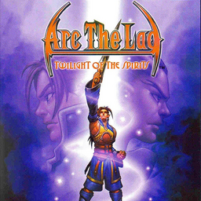

# Arc the Lad: Twilight of the Spirits

## PS2 Saves - SCUS97231

| Icon | Filename | Description |
|------|----------|-------------|
|  | [00000001.zip](00000001.zip){: .btn .btn-purple } | BASCUS-97231: Arc The Lad (1_Arc_The_La_213315.max) |
|  | [00000002.zip](00000002.zip){: .btn .btn-purple } | BASCUS-97231: Arc The Lad (12116_Arc_The_La_420544.max) |
|  | [00000003.zip](00000003.zip){: .btn .btn-purple } | BASCUS-97231: Exploit (1_Exploit_360577.max) |
|  | [00000004.zip](00000004.zip){: .btn .btn-purple } | BASCUS-97231: Arc The Lad (1_Arc_The_La_880947.max) |
|  | [00000100.zip](00000100.zip){: .btn .btn-purple } | Have Cash, Stones, Stats etc From The Start. You will start at the beginning of the game but will already have Max Cash and Spirit Stones, Max Stats Kharg and Paulette |
