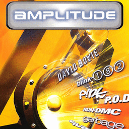

# Amplitude

## PS2 Saves - SCUS97258

| Icon | Filename | Description |
|------|----------|-------------|
|  | [00000001.zip](00000001.zip){: .btn .btn-purple } | BASCUS-97258mix2: Amplitude Mixes 2 (1871_Amplitude__538510.max) |
|  | [00000002.zip](00000002.zip){: .btn .btn-purple } | BASCUS-97258freqs: Amplitude Data (1871_Amplitude__111767.max) |
|  | [00000003.zip](00000003.zip){: .btn .btn-purple } | BASCUS-97258mix0: Amplitude Mixes 0 (1871_Amplitude__766338.max) |
|  | [00000004.zip](00000004.zip){: .btn .btn-purple } | BASCUS-97258mix0: Amplitude Mixes 0 (1_Amplitude__565167.max) |
|  | [00000005.zip](00000005.zip){: .btn .btn-purple } | BASCUS-97258mix2: Amplitude Mixes 2 (1871_Amplitude__194531.max) |
|  | [00000006.zip](00000006.zip){: .btn .btn-purple } | BASCUS-97258mix2: Amplitude Mixes 2 (5130_Amplitude__686871.max) |
|  | [00000007.zip](00000007.zip){: .btn .btn-purple } | BASCUS-97258mix0: Amplitude Mixes 0 (1871_Amplitude__483731.max) |
|  | [00000008.zip](00000008.zip){: .btn .btn-purple } | BASCUS-97258mix1: Amplitude Mixes 1 (1871_Amplitude__750469.max) |
|  | [00000009.zip](00000009.zip){: .btn .btn-purple } | BASCUS-97258mix0: Amplitude Mixes 0 (1_Amplitude__290020.max) |
|  | [00000010.zip](00000010.zip){: .btn .btn-purple } | BASCUS-97258freqs: Amplitude Data (1871_Amplitude__224972.max) |
|  | [00000011.zip](00000011.zip){: .btn .btn-purple } | BASCUS-97258mix1: Amplitude Mixes 1 (5130_Amplitude__832195.max) |
|  | [00000012.zip](00000012.zip){: .btn .btn-purple } | BASCUS-97258freqs: Amplitude Data (10102_Amplitude__562283.max) |
