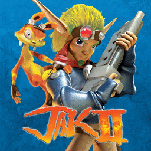

# Jak II

## PS2 Saves - SCUS97265

| Icon | Filename | Description |
|------|----------|-------------|
|  | [00000001.zip](00000001.zip){: .btn .btn-purple } | BASCUS-97265AYBABTU!: Jak II (3472_Jak_II_538815.max) |
|  | [00000002.zip](00000002.zip){: .btn .btn-purple } | BASCUS-97265AYBABTU!: Jak II (13424_Jak_II_262524.max) |
|  | [00000003.zip](00000003.zip){: .btn .btn-purple } | BASCUS-97265AYBABTU!: Jak II (2811_Jak_II_145505.max) |
|  | [00000004.zip](00000004.zip){: .btn .btn-purple } | BASCUS-97265AYBABTU!: Jak II (11061_Jak_II_777859.max) |
|  | [00000005.zip](00000005.zip){: .btn .btn-purple } | BASCUS-97265AYBABTU!: Jak II (7477_Jak_II_887066.max) |
|  | [00000006.zip](00000006.zip){: .btn .btn-purple } | BASCUS-97265AYBABTU!: Jak II (14853_Jak_II_285580.max) |
|  | [00000007.zip](00000007.zip){: .btn .btn-purple } | BASCUS-97265AYBABTU!: Jak II (1_Jak_II_141354.max) |
|  | [00000008.zip](00000008.zip){: .btn .btn-purple } | BASCUS-97265AYBABTU!: Jak II (0_Jak_II_Pow_362439.max) |
|  | [00000009.zip](00000009.zip){: .btn .btn-purple } | BASCUS-97265AYBABTU!: JakI (1_JakI_999599.max) |
|  | [00000010.zip](00000010.zip){: .btn .btn-purple } | BASCUS-97265AYBABTU!: Jak II (1_Jak_II_116314.max) |
