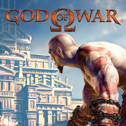

# God of War

## PS2 Saves - SCUS97399

| Icon | Filename | Description |
|------|----------|-------------|
|  | [00000001.zip](00000001.zip){: .btn .btn-purple } | BASCUS-97399GodOfWar: God Of War (11107_God_Of_War_76352.max) |
|  | [00000002.zip](00000002.zip){: .btn .btn-purple } | BASCUS-97399GodOfWar: God Of War (1392_God_Of_War_832821.max) |
|  | [00000003.zip](00000003.zip){: .btn .btn-purple } | BASCUS-97399GodOfWar: God Of War (9098_God_Of_War_529629.max) |
|  | [00000004.zip](00000004.zip){: .btn .btn-purple } | BASCUS-97399GodOfWar: God Of War (9680_God_Of_War_378735.max) |
|  | [00000005.zip](00000005.zip){: .btn .btn-purple } | BASCUS-97399GodOfWar: God Of War (11318_God_Of_War_746120.max) |
|  | [00000006.zip](00000006.zip){: .btn .btn-purple } | BASCUS-97399GodOfWar: God Of War (1_God_Of_War_847759.max) |
|  | [00000007.zip](00000007.zip){: .btn .btn-purple } | BASCUS-97399GodOfWar: God Of War (9934_God_Of_War_973980.max) |
|  | [00000008.zip](00000008.zip){: .btn .btn-purple } | BASCUS-97399GodOfWar: God Of War (10173_God_Of_War_356060.max) |
|  | [00000009.zip](00000009.zip){: .btn .btn-purple } | BASCUS-97399GodOfWar: God Of War (10701_God_Of_War_810558.max) |
