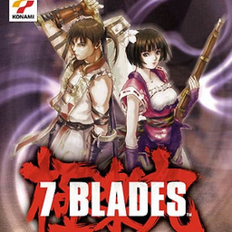

# 7 Blades

## PS2 Saves - SLES50109

| Icon | Filename | Description |
|------|----------|-------------|
|  | [00000001.zip](00000001.zip){: .btn .btn-purple } | BESLES-50109GOKU0001: 7BLADES (1_7BLADES_809673.max) |
|  | [00000002.zip](00000002.zip){: .btn .btn-purple } | BESLES-50109GOKU0001: 7BLADES (1_7BLADES_876659.max) |
|  | [00000003.zip](00000003.zip){: .btn .btn-purple } | BESLES-50109GOKU0001: 7BLADES (1160_7BLADES_95517.max) |
|  | [00000004.zip](00000004.zip){: .btn .btn-purple } | BESLES-50109GOKU0001: 7BLADES (1_7BLADES_513973.max) |
|  | [00000005.zip](00000005.zip){: .btn .btn-purple } | BESLES-50109GOKU0001: 7BLADES (1_7BLADES_812328.max) |
|  | [00000100.zip](00000100.zip){: .btn .btn-purple } | Every Level Saved. Every Level Saved From The 'Shrine' To 'Game Complete' Using Gokuraku-Maru |
