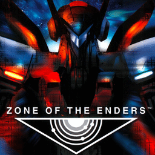

# Zone of the Enders

## PS2 Saves - SLES50111

| Icon | Filename | Description |
|------|----------|-------------|
|  | [00000001.zip](00000001.zip){: .btn .btn-purple } | BESLES-50111: langy - Zone Of The Enders - co (1_langy___Zo_416485.max) |
|  | [00000002.zip](00000002.zip){: .btn .btn-purple } | BESLES-50111: Zone Of The Enders (981_Zone_Of_Th_150372.max) |
|  | [00000003.zip](00000003.zip){: .btn .btn-purple } | BESLES-50111: Zone Of The Enders (4605_Zone_Of_Th_864406.max) |
|  | [00000004.zip](00000004.zip){: .btn .btn-purple } | BESLES-50111: Zone Of The Enders (1143_Zone_Of_Th_99988.max) |
|  | [00000005.zip](00000005.zip){: .btn .btn-purple } | BESLES-50111: Zone Of The Enders (8431_Zone_Of_Th_714703.max) |
