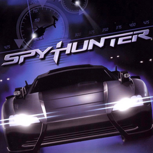

# SpyHunter

## PS2 Saves - SLES50268

| Icon | Filename | Description |
|------|----------|-------------|
|  | [00000001.zip](00000001.zip){: .btn .btn-purple } | BESLES-50268SPYHUNT:  SPY HUNTER (1981_SPY_HUNTER_495739.max) |
|  | [00000002.zip](00000002.zip){: .btn .btn-purple } | BESLES-50268SPYHUNT:  SPY HUNTER (1__SPY_HUNTE_930263.max) |
|  | [00000003.zip](00000003.zip){: .btn .btn-purple } | BESLES-50268SPYHUNT:  SPY HUNTER (1__SPY_HUNTE_226788.max) |
|  | [00000004.zip](00000004.zip){: .btn .btn-purple } | BESLES-50268SPYHUNT:  SPY HUNTER (8616_SPY_HUNTER_367230.max) |
