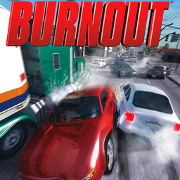

# Burnout

## PS2 Saves - SLES50445

| Icon | Filename | Description |
|------|----------|-------------|
|  | [00000001.zip](00000001.zip){: .btn .btn-purple } | BESLES-50445Crash001: Burnout Crash Replay 01 (3297_Burnout_Cr_211895.max) |
|  | [00000002.zip](00000002.zip){: .btn .btn-purple } | BESLES-50445Crash000: Burnout Crash Replay 00 (424_Burnout_Cr_82883.max) |
|  | [00000003.zip](00000003.zip){: .btn .btn-purple } | BESLES-50445Burn: Burnout (1_Burnout_656353.max) |
|  | [00000004.zip](00000004.zip){: .btn .btn-purple } | BESLES-50445Crash000: Burnout Crash Replay 00 (3297_Burnout_Cr_348309.max) |
|  | [00000100.zip](00000100.zip){: .btn .btn-purple } | All Tracks Open, All Cars Open, Championship Open, All Modes Open. |
