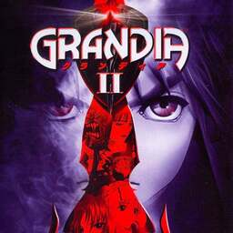

# Grandia II

## PS2 Saves - SLES50498

| Icon | Filename | Description |
|------|----------|-------------|
|  | [00000001.zip](00000001.zip){: .btn .btn-purple } | BESLES-50498G07: GRANDIA2_08 (0_Grandia_2__367443.max) |
|  | [00000002.zip](00000002.zip){: .btn .btn-purple } | BESLES-50498G00: GRANDIA2_01 (281_GRANDIA2_0_688320.max) |
|  | [00000003.zip](00000003.zip){: .btn .btn-purple } | BESLES-50498G01: GRANDIA2_02 (281_GRANDIA2_0_40478.max) |
|  | [00000004.zip](00000004.zip){: .btn .btn-purple } | BESLES-50498G07: GRANDIA2_08 (5222_GRANDIA2_0_893154.max) |
|  | [00000100.zip](00000100.zip){: .btn .btn-purple } | At Birthplace Of The Gods, Level 3. |
|  | [00000101.zip](00000101.zip){: .btn .btn-purple } | Valmars Moon, Level 3. |
|  | [00000102.zip](00000102.zip){: .btn .btn-purple } | Roul Hills, Level 2. |
|  | [00000103.zip](00000103.zip){: .btn .btn-purple } | Cathedral, Guest Room Corridoor. |
