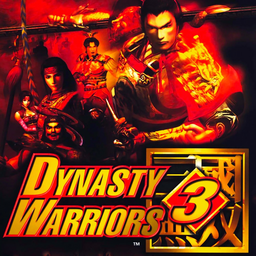

# Dynasty Warriors 3

## PS2 Saves - SLES50641

| Icon | Filename | Description |
|------|----------|-------------|
|  | [00000001.zip](00000001.zip){: .btn .btn-purple } | BESLES-50641XXXXXXXX: Dynasty Warriors 3 (0_Dynasty_Wa_838253.max) |
|  | [00000002.zip](00000002.zip){: .btn .btn-purple } | BESLES-50641XXXXXXXX: Dynasty Warriors 3 (2161_Dynasty_Wa_265393.max) |
|  | [00000003.zip](00000003.zip){: .btn .btn-purple } | BESLES-50641XXXXXXXX: Dynasty Warriors 3 espaol (1_Dynasty_Wa_874782.max) |
|  | [00000004.zip](00000004.zip){: .btn .btn-purple } | BESLES-50641XXXXXXXX: Dynasty Warriors 3 (609_Dynasty_Wa_608135.max) |
|  | [00000005.zip](00000005.zip){: .btn .btn-purple } | BESLES-50641XXXXXXXX: Dynasty Warriors 3 (1_Dynasty_Wa_158658.max) |
|  | [00000006.zip](00000006.zip){: .btn .btn-purple } | BESLES-50641XXXXXXXX: Dynasty Warriors 3 (1_Dynasty_Wa_220746.max) |
