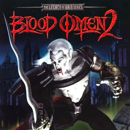

# Blood Omen 2: The Legacy of Kain Series

## PS2 Saves - SLES50771

| Icon | Filename | Description |
|------|----------|-------------|
|  | [00000001.zip](00000001.zip){: .btn .btn-purple } | BESLES-50771bo200004: Blood Omen 2Game 5 (1_Blood_Omen_893642.max) |
|  | [00000002.zip](00000002.zip){: .btn .btn-purple } | BESLES-50771bo200009: Blood Omen 2Game 10 (1_Blood_Omen_5948.max) |
|  | [00000100.zip](00000100.zip){: .btn .btn-purple } | Level 10 Wharfs - Start. |
|  | [00000101.zip](00000101.zip){: .btn .btn-purple } | Level 8 Eternal Prison - Start. |
|  | [00000102.zip](00000102.zip){: .btn .btn-purple } | Level 6 Industrial Quarter - Start. |
|  | [00000103.zip](00000103.zip){: .btn .btn-purple } | Level 11 Hylden City - Final Fight. |
|  | [00000104.zip](00000104.zip){: .btn .btn-purple } | Level 11 Hylden City - Start. |
