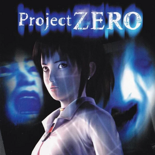

# Project Zero

## PS2 Saves - SLES50821

| Icon | Filename | Description |
|------|----------|-------------|
|  | [00000001.zip](00000001.zip){: .btn .btn-purple } | BESLES-50821zero0: ProjectZEROGAMEDATA (188_ProjectZER_809536.max) |
|  | [00000002.zip](00000002.zip){: .btn .btn-purple } | BESLES-50821zero0: ProjectZEROGAMEDATA (268_Project_ZE_667202.max) |
|  | [00000003.zip](00000003.zip){: .btn .btn-purple } | BESLES-50821zero0: ProjectZEROGAMEDATA (5167_ProjectZER_876034.max) |
|  | [00000004.zip](00000004.zip){: .btn .btn-purple } | BESLES-50821zero0: ProjectZEROGAMEDATA (1160_ProjectZER_802944.max) |
|  | [00000005.zip](00000005.zip){: .btn .btn-purple } | BESLES-50821zero0: ProjectZEROGAMEDATA (4175_ProjectZER_821560.max) |
