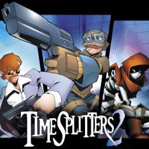

# TimeSplitters 2

## PS2 Saves - SLES50877

| Icon | Filename | Description |
|------|----------|-------------|
|  | [00000001.zip](00000001.zip){: .btn .btn-purple } | BESLES-50877-TS2-MAP: TimeSplitters 2(Saved Maps) (770_TimeSplitt_559048.max) |
|  | [00000002.zip](00000002.zip){: .btn .btn-purple } | BESLES-50877-TS2-MAP: TimeSplitters 2(Saved Maps) (883_TimeSplitt_306286.max) |
|  | [00000003.zip](00000003.zip){: .btn .btn-purple } | BESLES-50877-TS2-OPT: TimeSplitters 2(Game Settings) (1_TimeSplitt_655499.max) |
|  | [00000004.zip](00000004.zip){: .btn .btn-purple } | BESLES-50877-TS2-OPT: TimeSplitters 2(Game Settings) (9294_TimeSplitt_532314.max) |
|  | [00000005.zip](00000005.zip){: .btn .btn-purple } | BESLES-50877-TS2-OPT: TimeSplitters 2(Game Settings) (5711_TimeSplitt_934765.max) |
|  | [00000006.zip](00000006.zip){: .btn .btn-purple } | BESLES-50877-TS2-OPT: TimeSplitters 2(Game Settings) (4104_toms_save__743618.max) |
|  | [00000007.zip](00000007.zip){: .btn .btn-purple } | BESLES-50877-TS2-OPT: TimeSplitters 2(Game Settings) (1_TimeSplitt_26944.max) |
|  | [00000008.zip](00000008.zip){: .btn .btn-purple } | BESLES-50877-TS2-MAP: TimeSplitters 2(Saved Maps) (0_TCAPTURETH_448498.max) |
|  | [00000009.zip](00000009.zip){: .btn .btn-purple } | BESLES-50877-TS2-OPT: TimeSplitters 2(Game Settings) (1_TimeSplitt_55615.max) |
|  | [00000010.zip](00000010.zip){: .btn .btn-purple } | BESLES-50877-TS2-MAP: TimeSplitters 2(Saved Maps) (1_TimeSplitt_392163.max) |
|  | [00000011.zip](00000011.zip){: .btn .btn-purple } | BESLES-50877-TS2-MAP: TimeSplitters 2(Saved Maps) (0_DMEXPLOSIV_639004.max) |
|  | [00000012.zip](00000012.zip){: .btn .btn-purple } | BESLES-50877-TS2-MAP: TimeSplitters 2(Saved Maps) (0_TEAMDMTHE__281155.max) |
|  | [00000013.zip](00000013.zip){: .btn .btn-purple } | BESLES-50877-TS2-MAP: TimeSplitters 2(Saved Maps) (1_TimeSplitt_937496.max) |
|  | [00000014.zip](00000014.zip){: .btn .btn-purple } | BESLES-50877-TS2-MAP: TimeSplitters 2(Saved Maps) (0_TEAMDMTWIN_808010.max) |
|  | [00000015.zip](00000015.zip){: .btn .btn-purple } | BESLES-50877-TS2-MAP: TimeSplitters 2(Saved Maps) (0_THEARENAS_747234.max) |
|  | [00000016.zip](00000016.zip){: .btn .btn-purple } | BESLES-50877-TS2-MAP: TimeSplitters 2(Saved Maps) (211_TimeSplitt_191754.max) |
|  | [00000017.zip](00000017.zip){: .btn .btn-purple } | BESLES-50877-TS2-MAP: TimeSplitters 2(Saved Maps) (211_TimeSplitt_206494.max) |
|  | [00000018.zip](00000018.zip){: .btn .btn-purple } | BESLES-50877-TS2-OPT: TimeSplitters 2(Game Settings) (184_TimeSplitt_344342.max) |
|  | [00000019.zip](00000019.zip){: .btn .btn-purple } | BESLES-50877-TS2-OPT: TimeSplitters 2(Game Settings) (804_TimeSplitt_592678.max) |
|  | [00000020.zip](00000020.zip){: .btn .btn-purple } | BESLES-50877-TS2-MAP: TimeSplitters 2(Saved Maps) (0_BAGTAG_618298.max) |
|  | [00000021.zip](00000021.zip){: .btn .btn-purple } | BESLES-50877-TS2-MAP: TimeSplitters 2(Saved Maps) (211_TimeSplitt_294644.max) |
|  | [00000022.zip](00000022.zip){: .btn .btn-purple } | BESLES-50877-TS2-MAP: TimeSplitters 2(Saved Maps) (0_TRONBAGCAP_365689.max) |
|  | [00000023.zip](00000023.zip){: .btn .btn-purple } | BESLES-50877-TS2-OPT: TimeSplitters 2(Game Settings) (770_TimeSplitt_549709.max) |
|  | [00000024.zip](00000024.zip){: .btn .btn-purple } | BESLES-50877-TS2-MAP: TimeSplitters 2(Saved Maps) (0_SINGLEDM_622448.max) |
