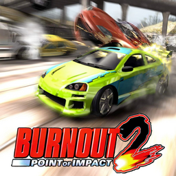

# Burnout 2: Point of Impact

## PS2 Saves - SLES51044

| Icon | Filename | Description |
|------|----------|-------------|
|  | [00000001.zip](00000001.zip){: .btn .btn-purple } | BESLES-51044: Burnout 2 (2184_Burnout_2_431134.max) |
|  | [00000002.zip](00000002.zip){: .btn .btn-purple } | BESLES-51044: Burnout 2 (1913_Burnout_2_495938.max) |
|  | [00000003.zip](00000003.zip){: .btn .btn-purple } | BESLES-51044: Burnout 2 (1_Burnout_2_635174.max) |
|  | [00000004.zip](00000004.zip){: .btn .btn-purple } | BESLES-51044: Burnout 2 (1_Burnout_2_718685.max) |
|  | [00000005.zip](00000005.zip){: .btn .btn-purple } | BESLES-51044: Burnout 2 (521_Burnout_2_523739.max) |
|  | [00000006.zip](00000006.zip){: .btn .btn-purple } | BESLES-51044: Burnout 2 (804_Burnout_2_45331.max) |
|  | [00000007.zip](00000007.zip){: .btn .btn-purple } | BESLES-51044: Burnout 2 (3749_Burnout_2_954754.max) |
|  | [00000008.zip](00000008.zip){: .btn .btn-purple } | BESLES-51044: Burnout 2 (5429_Burnout_2__974773.max) |
|  | [00000009.zip](00000009.zip){: .btn .btn-purple } | BESLES-51044: Burnout 2 (3244_Burnout_2_234265.max) |
|  | [00000010.zip](00000010.zip){: .btn .btn-purple } | BESLES-51044: Burnout 2 (1_Burnout_2_788113.max) |
|  | [00000011.zip](00000011.zip){: .btn .btn-purple } | BESLES-51044: Burnout 2 (1_Burnout_2_277432.max) |
|  | [00000012.zip](00000012.zip){: .btn .btn-purple } | BESLES-51044: Burnout 2 (1_Burnout_2_877346.max) |
