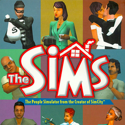

# The Sims

## PS2 Saves - SLES51257

| Icon | Filename | Description |
|------|----------|-------------|
|  | [00000001.zip](00000001.zip){: .btn .btn-purple } | BESLES-51257NgmcIiKD: Sims save CRIMSFEILD (1_Sims_save__841610.max) |
|  | [00000002.zip](00000002.zip){: .btn .btn-purple } | BESLES-51257NoOHonbA: Sims save DATELSVILLE (0_The_Sims_P_227536.max) |
|  | [00000003.zip](00000003.zip){: .btn .btn-purple } | BESLES-51257SaKgfOKD: Sims life ENRIGHT (1195_Sims_life_372753.max) |
|  | [00000004.zip](00000004.zip){: .btn .btn-purple } | BESLES-51257NoOHonbA: Sims save DATELSVILLE (1_Sims_save__424450.max) |
|  | [00000005.zip](00000005.zip){: .btn .btn-purple } | BESLES-51257NPbNciIC: Die Sims speicheGERA (1_Die_Sims_s_198285.max) |
|  | [00000100.zip](00000100.zip){: .btn .btn-purple } | Start With Stacks Of Cash And A Massive Mansion. |
