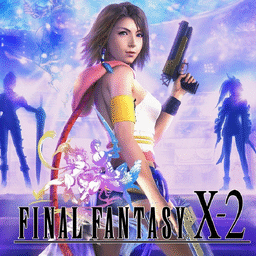

# Final Fantasy X-2

## PS2 Saves - SLES51815

| Icon | Filename | Description |
|------|----------|-------------|
|  | [00000001.zip](00000001.zip){: .btn .btn-purple } | BESLES-51815FF101000: FFX-2 [01]152:57New Game Plus (4605_FFX_2__01__356945.max) |
|  | [00000002.zip](00000002.zip){: .btn .btn-purple } | BESLES-51815FF101001: FFX-2 [02] 76:51Celsius-Bridge (1_FFX_2__02__570614.max) |
|  | [00000003.zip](00000003.zip){: .btn .btn-purple } | BESLES-51815FF101000: FFX-2 [01] 25:49Celsius-Bridge (769_FFX_2__01__833324.max) |
|  | [00000004.zip](00000004.zip){: .btn .btn-purple } | BESLES-51815FF101000: FFX-2 [01]  0:00NONAME (1_FFX_2__01__945720.max) |
|  | [00000005.zip](00000005.zip){: .btn .btn-purple } | BESLES-51815FF101001: FFX-2 [02] 91:33New Game Plus (898_FFX_2__02__170056.max) |
|  | [00000006.zip](00000006.zip){: .btn .btn-purple } | BESLES-51815FF101000: FFX-2 [01] 18:16Farplane-Heart (4104_FFX_2_all__519146.max) |
|  | [00000007.zip](00000007.zip){: .btn .btn-purple } | BESLES-51815FF101020: FFX-2 [21] 93:15New Game Plus (1_FFX_2__21__628002.max) |
|  | [00000008.zip](00000008.zip){: .btn .btn-purple } | BESLES-51815FF101000: FFX-2 [01]  0:00NONAME (7611_FFX_2__01__928127.max) |
