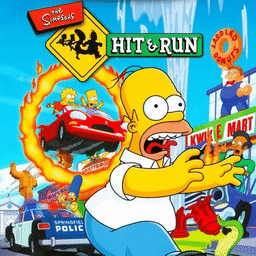

# The Simpsons: Hit & Run

## PS2 Saves - SLES51897

| Icon | Filename | Description |
|------|----------|-------------|
|  | [00000001.zip](00000001.zip){: .btn .btn-purple } | Game history 100% completed, including bonus missions, all cards unlocked! |
|  | [00000011.zip](00000011.zip){: .btn .btn-purple } | BESLES-51897Save1: The Simpsons:Hit & Run (1) (5167_The_Simpso_904720.max) |
|  | [00000002.zip](00000002.zip){: .btn .btn-purple } | BESLES-51897Save1: The Simpsons:Hit & Run (Fr) (1_The_Simpso_748897.max) |
|  | [00000003.zip](00000003.zip){: .btn .btn-purple } | BESLES-51897Save3: The Simpsons:Hit & Run (3) (1_The_Simpso_205456.max) |
|  | [00000004.zip](00000004.zip){: .btn .btn-purple } | BESLES-51897Save1: The Simpsons:Hit & Run (1) (4584_The_Simpso_171032.max) |
|  | [00000005.zip](00000005.zip){: .btn .btn-purple } | BESLES-51897Save2: The Simpsons:Hit & Run (2) (5167_The_Simpso_365780.max) |
|  | [00000006.zip](00000006.zip){: .btn .btn-purple } | BESLES-51897Save1: The Simpsons:Hit & Run (1) (3271_The_Simpso_198544.max) |
|  | [00000007.zip](00000007.zip){: .btn .btn-purple } | BESLES-51897Save1: The Simpsons:Hit & Run (1_The_Simpso_324093.max) |
|  | [00000008.zip](00000008.zip){: .btn .btn-purple } | BESLES-51897Save1: The Simpsons:Hit & Run (1) (5745_The_Simpso_514080.max) |
