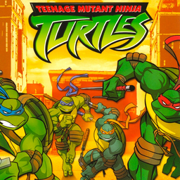

# Teenage Mutant Ninja Turtles

## PS2 Saves - SLES51931

| Icon | Filename | Description |
|------|----------|-------------|
|  | [00000001.zip](00000001.zip){: .btn .btn-purple } | BESLES-51931tmnt: TMNT (1_TMNT_93320.max) |
|  | [00000002.zip](00000002.zip){: .btn .btn-purple } | BESLES-51931tmnt: TMNT (1_TMNT_312344.max) |
|  | [00000003.zip](00000003.zip){: .btn .btn-purple } | BESLES-51931tmnt: TMNT (0_TMNT_Power_30453.max) |
|  | [00000004.zip](00000004.zip){: .btn .btn-purple } | BESLES-51931tmnt: TMNT (8297_TMNT_843319.max) |
|  | [00000005.zip](00000005.zip){: .btn .btn-purple } | BESLES-51931tmnt: TMNT (1_TMNT_982448.max) |
