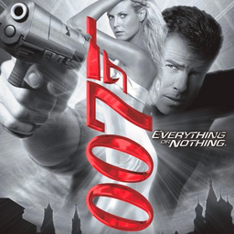

# 007: Everything or Nothing

## PS2 Saves - SLES52005

| Icon | Filename | Description |
|------|----------|-------------|
|  | [00000001.zip](00000001.zip){: .btn .btn-purple } | BESLES-52005Raymon: 007: Profiel Raymon (1_007__Profi_876034.max) |
|  | [00000002.zip](00000002.zip){: .btn .btn-purple } | BESLES-52005JB007EON: 007: Opgeslagen spelbestanden (1_007__Opges_323864.max) |
|  | [00000003.zip](00000003.zip){: .btn .btn-purple } | BESLES-52005JB007EON: 007: Saved game data (1_007__Saved_805935.max) |
|  | [00000004.zip](00000004.zip){: .btn .btn-purple } | BESLES-52005W: 007: Profile W (4759_007__Profi_873211.max) |
|  | [00000005.zip](00000005.zip){: .btn .btn-purple } | BESLES-52005007: 007: Profiel 007 (1_007__Profi_856014.max) |
|  | [00000006.zip](00000006.zip){: .btn .btn-purple } | BESLES-52005JUNAIB: 007: Profile JUNAIB (1_007__Profi_713680.max) |
|  | [00000007.zip](00000007.zip){: .btn .btn-purple } | BESLES-52005JB007EON: 007: Saved game data (1_007__Saved_911678.max) |
