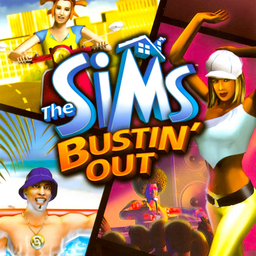

# The Sims: Bustin' Out

## PS2 Saves - SLES52047

| Icon | Filename | Description |
|------|----------|-------------|
|  | [00000001.zip](00000001.zip){: .btn .btn-purple } | BESLES-52047: Sims Bustin Out (3680_Sims_Busti_543530.max) |
|  | [00000002.zip](00000002.zip){: .btn .btn-purple } | BESLES-52047: Sims Bustin Out (8194_aaaaaaaaaa_370541.max) |
|  | [00000003.zip](00000003.zip){: .btn .btn-purple } | BESLES-52047: Sims Bustin Out (282_Sims_Busti_154110.max) |
|  | [00000004.zip](00000004.zip){: .btn .btn-purple } | BESLES-52047: Sims Bustin Out (5342_Sims_Busti_356884.max) |
|  | [00000005.zip](00000005.zip){: .btn .btn-purple } | BESLES-52047: Sims Bustin Out (5390_Sims_Busti_830654.max) |
|  | [00000006.zip](00000006.zip){: .btn .btn-purple } | BESLES-52047: Sims Bustin Out (1_Sims_Busti_571636.max) |
|  | [00000007.zip](00000007.zip){: .btn .btn-purple } | BESLES-52047: Sims Bustin Out (0_Bustin_Out_90054.max) |
|  | [00000008.zip](00000008.zip){: .btn .btn-purple } | BESLES-52047: Sims Bustin Out (303_Sims_Busti_632458.max) |
|  | [00000009.zip](00000009.zip){: .btn .btn-purple } | BESLES-52047: Sims Bustin Out (1_Sims_Busti_708233.max) |
