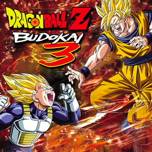

# Dragon Ball Z: Budokai 3

## PS2 Saves - SLES52730

| Icon | Filename | Description |
|------|----------|-------------|
|  | [00000001.zip](00000001.zip){: .btn .btn-purple } | BESLES-52730DBZ3: DRAGON BALL ZBUDOKAI3 (4819_DRAGON_BAL_796017.max) |
|  | [00000002.zip](00000002.zip){: .btn .btn-purple } | BESLES-52730DBZ3: DRAGON BALL ZBUDOKAI3 (4399_DRAGON_BAL_441021.max) |
|  | [00000003.zip](00000003.zip){: .btn .btn-purple } | BESLES-52730DBZ3: DRAGON BALL ZBUDOKAI3 (2153_DRAGON_BAL_964229.max) |
|  | [00000004.zip](00000004.zip){: .btn .btn-purple } | BESLES-52730DBZ3: DRAGON BALL ZBUDOKAI3 (2529_DRAGON_BAL_617580.max) |
|  | [00000005.zip](00000005.zip){: .btn .btn-purple } | BESLES-52730DBZ3: DRAGON BALL ZBUDOKAI3 (2353_DRAGON_BAL_742809.max) |
|  | [00000006.zip](00000006.zip){: .btn .btn-purple } | BESLES-52730DBZ3: DRAGON BALL ZBUDOKAI3 (3662_DRAGON_BAL_601986.max) |
|  | [00000007.zip](00000007.zip){: .btn .btn-purple } | BESLES-52730DBZ3: DRAGON BALL ZBUDOKAI3 (2323_DRAGON_BAL_882763.max) |
|  | [00000008.zip](00000008.zip){: .btn .btn-purple } | BESLES-52730DBZ3: DRAGON BALL ZBUDOKAI3 (2813_DRAGON_BAL_868557.max) |
|  | [00000009.zip](00000009.zip){: .btn .btn-purple } | BESLES-52730DBZ3: DRAGON BALL ZBUDOKAI3 (2151_DRAGON_BAL_300930.max) |
