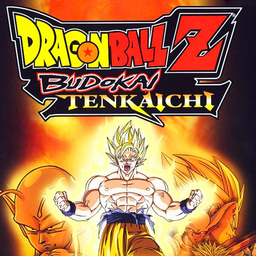

# Dragon Ball Z: Budokai Tenkaichi

## PS2 Saves - SLES53200

| Icon | Filename | Description |
|------|----------|-------------|
|  | [00000001.zip](00000001.zip){: .btn .btn-purple } | BESLES-53200DBZT: DBZ-BUDOKAI-TENKAICHI (4097_DBZ_BUDOKA_31674.max) |
|  | [00000002.zip](00000002.zip){: .btn .btn-purple } | BESLES-53200DBZT: DBZ-BUDOKAI-TENKAICHI (4458_DBZ_BUDOKA_104107.max) |
|  | [00000003.zip](00000003.zip){: .btn .btn-purple } | BESLES-53200DBZT: DBZ-BUDOKAI-TENKAICHI (7369_DBZ_BUDOKA_718105.max) |
|  | [00000004.zip](00000004.zip){: .btn .btn-purple } | BESLES-53200DBZT: DBZ-BUDOKAI-TENKAICHI (4011_DBZ_BUDOKA_306515.max) |
|  | [00000005.zip](00000005.zip){: .btn .btn-purple } | BESLES-53200DBZT: DBZ-BUDOKAI-TENKAICHI (3895_DBZ_BUDOKA_463497.max) |
|  | [00000006.zip](00000006.zip){: .btn .btn-purple } | BESLES-53200DBZT: DBZ-BUDOKAI-TENKAICHI (5583_DBZ_BUDOKA_162915.max) |
|  | [00000007.zip](00000007.zip){: .btn .btn-purple } | BESLES-53200DBZT: DBZ-BUDOKAI-TENKAICHI (4074_DBZ_BUDOKA_735775.max) |
