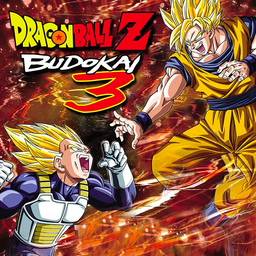

# Dragon Ball Z: Budokai 3: Collector's Edition

## PS2 Saves - SLES53346

| Icon | Filename | Description |
|------|----------|-------------|
|  | [00000001.zip](00000001.zip){: .btn .btn-purple } | BESLES-53346DBZ3: DRAGON BALL ZBUDOKAI3 CE (1_DRAGON_BAL_957607.max) |
|  | [00000002.zip](00000002.zip){: .btn .btn-purple } | BESLES-53346DBZ3: DRAGON BALL ZBUDOKAI3 CE (1678_DRAGONBALL_621456.max) |
|  | [00000003.zip](00000003.zip){: .btn .btn-purple } | BESLES-53346DBZ3: DRAGON BALL ZBUDOKAI3 CE (1_DRAGON_BAL_274350.max) |
|  | [00000004.zip](00000004.zip){: .btn .btn-purple } | BESLES-53346DBZ3: DRAGON BALL ZBUDOKAI3 CE (1_DRAGON_BAL_278134.max) |
|  | [00000005.zip](00000005.zip){: .btn .btn-purple } | BESLES-53346DBZ3: DRAGON BALL ZBUDOKAI3 CE (843_DRAGON_BAL_171002.max) |
|  | [00000006.zip](00000006.zip){: .btn .btn-purple } | BESLES-53346DBZ3: DRAGON BALL ZBUDOKAI3 CE (8431_DRAGON_BAL_835186.max) |
|  | [00000007.zip](00000007.zip){: .btn .btn-purple } | BESLES-53346DBZ3: DRAGON BALL ZBUDOKAI3 CE (1_DRAGON_BAL_894085.max) |
