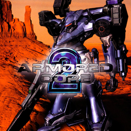

# Armored Core 2

## PS2 Saves - SLUS20014

| Icon | Filename | Description |
|------|----------|-------------|
|  | [00000001.zip](00000001.zip){: .btn .btn-purple } | BASLUS-20014S00: AC2 No.1 SORTIE:010 (1_AC2_No_1_S_383953.max) |
|  | [00000002.zip](00000002.zip){: .btn .btn-purple } | BASLUS-20014S01: AC:2 Master Save (1_AC_2_Maste_492642.max) |
|  | [00000003.zip](00000003.zip){: .btn .btn-purple } | BASLUS-20014S00: AC2 No.1 SORTIE:045 (12564_AC2_No_1_S_992885.max) |
|  | [00000004.zip](00000004.zip){: .btn .btn-purple } | BASLUS-20014S00: AC2 No.1 SORTIE:054 (4731_Armored_Co_515896.max) |
|  | [00000005.zip](00000005.zip){: .btn .btn-purple } | BASLUS-20014S00: AC2 No.1 SORTIE:036 (1_AC2_No_1_S_731060.max) |
