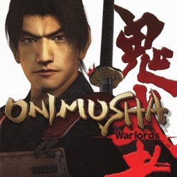

# Onimusha: Warlords

## PS2 Saves - SLUS20018

| Icon | Filename | Description |
|------|----------|-------------|
|  | [00000001.zip](00000001.zip){: .btn .btn-purple } | BASLUS-20018: ONIMUSHA (3965_ONIMUSHA_166043.max) |
|  | [00000002.zip](00000002.zip){: .btn .btn-purple } | BASLUS-20018: ONIMUSHA (23320_ONIMUSHA_G_587032.max) |
|  | [00000003.zip](00000003.zip){: .btn .btn-purple } | BASLUS-20018: ONIMUSHA (10343_ONIMUSHA_502804.max) |
|  | [00000004.zip](00000004.zip){: .btn .btn-purple } | BASLUS-20018: ONIMUSHA (20960_ONIMUSHAA_75284.max) |
|  | [00000005.zip](00000005.zip){: .btn .btn-purple } | BASLUS-20018: ONIMUSHA (1_ONIMUSHA_212826.max) |
|  | [00000006.zip](00000006.zip){: .btn .btn-purple } | BASLUS-20018: ONIMUSHA (8107_After_Wate_348873.max) |
|  | [00000100.zip](00000100.zip){: .btn .btn-purple } | Begin Game With Everything. |
