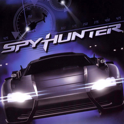

# SpyHunter

## PS2 Saves - SLUS20056

| Icon | Filename | Description |
|------|----------|-------------|
|  | [00000001.zip](00000001.zip){: .btn .btn-purple } | BASLUS-20056SPYHUNT:  SPY HUNTER (1__SPY_HUNTE_408657.max) |
|  | [00000002.zip](00000002.zip){: .btn .btn-purple } | BASLUS-20056SPYHUNT:  SPY HUNTER (135_SPY_HUNTER_501782.max) |
|  | [00000003.zip](00000003.zip){: .btn .btn-purple } | BASLUS-20056SPYHUNT: Spy Hunter (1_Spy_Hunter_13364.max) |
|  | [00000004.zip](00000004.zip){: .btn .btn-purple } | BASLUS-20056SPYHUNT:  SPY HUNTER (751_SPY_HUNTER_224652.max) |
|  | [00000005.zip](00000005.zip){: .btn .btn-purple } | BASLUS-20056SPYHUNT:  SPY HUNTER (1211_SPY_HUNTER_60177.max) |
|  | [00000100.zip](00000100.zip){: .btn .btn-purple } | All Missions Unlocked And Complete. |
