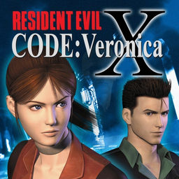

# Resident Evil: Code: Veronica X

## PS2 Saves - SLUS20184

| Icon | Filename | Description |
|------|----------|-------------|
|  | [00000001.zip](00000001.zip){: .btn .btn-purple } | BASLUS-20184: RESIDENT EVIL-CODE:Veronica-X (1_RESIDENT_E_726620.max) |
|  | [00000002.zip](00000002.zip){: .btn .btn-purple } | BASLUS-20184: RESIDENT EVIL-CODE:Veronica-X (26173_RESIDENT_E_816723.max) |
|  | [00000003.zip](00000003.zip){: .btn .btn-purple } | BASLUS-20184: RESIDENT EVIL-CODE:Veronica-X (26879_RESIDENT_E_651241.max) |
|  | [00000004.zip](00000004.zip){: .btn .btn-purple } | BASLUS-20184: RESIDENT EVIL-CODE:Veronica-X (26879_RESIDENT_E_327450.max) |
|  | [00000005.zip](00000005.zip){: .btn .btn-purple } | BASLUS-20184: RESIDENT EVIL-CODE:Veronica-X (1683_RESIDENT_E_518963.max) |
|  | [00000006.zip](00000006.zip){: .btn .btn-purple } | BASLUS-20184: RESIDENT EVIL-CODE:Veronica-X (7969_RESIDENT_E_351712.max) |
|  | [00000007.zip](00000007.zip){: .btn .btn-purple } | BASLUS-20184: RESIDENT EVIL-CODE:Veronica-X (25925_RESIDENT_E_216763.max) |
|  | [00000008.zip](00000008.zip){: .btn .btn-purple } | BASLUS-20184: RESIDENT EVIL-CODE:Veronica-X (1_RESIDENT_E_447399.max) |
|  | [00000009.zip](00000009.zip){: .btn .btn-purple } | BASLUS-20184: RESIDENT EVIL-CODE:Veronica-X (1_RESIDENT_E_341397.max) |
|  | [00000010.zip](00000010.zip){: .btn .btn-purple } | BASLUS-20184: RESIDENT EVIL-CODE:Veronica-X (26685_RESIDENT_E_753735.max) |
|  | [00000011.zip](00000011.zip){: .btn .btn-purple } | BASLUS-20184: RESIDENT EVIL-CODE:Veronica-X (4651_RESIDENT_E_240536.max) |
|  | [00000012.zip](00000012.zip){: .btn .btn-purple } | BASLUS-20184: RESIDENT EVIL-CODE:Veronica-X (1_RESIDENT_E_955456.max) |
|  | [00000013.zip](00000013.zip){: .btn .btn-purple } | BASLUS-20184: RESIDENT EVIL-CODE:Veronica-X (8519_RESIDENT_E_473934.max) |
|  | [00000014.zip](00000014.zip){: .btn .btn-purple } | BASLUS-20184: RESIDENT EVIL-CODE:Veronica-X (26497_Resident_E_91855.max) |
|  | [00000015.zip](00000015.zip){: .btn .btn-purple } | BASLUS-20184: RESIDENT EVIL-CODE:Veronica-X (0_Resident_E_766933.max) |
|  | [00000016.zip](00000016.zip){: .btn .btn-purple } | BASLUS-20184: RESIDENT EVIL-CODE:Veronica-X (1442_RESIDENT_E_622433.max) |
|  | [00000017.zip](00000017.zip){: .btn .btn-purple } | BASLUS-20184: RESIDENT EVIL-CODE:Veronica-X (27248_RESIDENT_E_293774.max) |
|  | [00000018.zip](00000018.zip){: .btn .btn-purple } | BASLUS-20184: RESIDENT EVIL-CODE:Veronica-X (1_RESIDENT_E_152722.max) |
|  | [00000019.zip](00000019.zip){: .btn .btn-purple } | BASLUS-20184: RESIDENT EVIL-CODE:Veronica-X (8933_RESIDENT_E_773525.max) |
|  | [00000020.zip](00000020.zip){: .btn .btn-purple } | BASLUS-20184: RESIDENT EVIL-CODE:Veronica-X (23989_RESIDENT_E_72461.max) |
|  | [00000021.zip](00000021.zip){: .btn .btn-purple } | BASLUS-20184: RESIDENT EVIL-CODE:Veronica-X (1_RESIDENT_E_628979.max) |
|  | [00000022.zip](00000022.zip){: .btn .btn-purple } | BASLUS-20184: RESIDENT EVIL-CODE:Veronica-X (23965_RESIDENT_E_570019.max) |
|  | [00000100.zip](00000100.zip){: .btn .btn-purple } | Begin with Rocket Launcher And Infinite Ammo. (All Items In Crate) |
