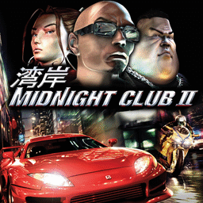

# Midnight Club II

## PS2 Saves - SLUS20209

| Icon | Filename | Description |
|------|----------|-------------|
|  | [00000001.zip](00000001.zip){: .btn .btn-purple } | BASLUS-20209Robbie: MC2     83.7%Robbie (9085_Midnight_C_46109.max) |
|  | [00000002.zip](00000002.zip){: .btn .btn-purple } | BASLUS-20209COREY: MC2     105.1%COREY (2371_MC2___105__188382.max) |
|  | [00000003.zip](00000003.zip){: .btn .btn-purple } | BASLUS-20209badass: MC2     100.0%badass (1392_MC2___100__28348.max) |
|  | [00000004.zip](00000004.zip){: .btn .btn-purple } | BASLUS-20209AKKILLA: MC2     105.1%AKKILLA (1_MC2_____10_948650.max) |
|  | [00000005.zip](00000005.zip){: .btn .btn-purple } | BASLUS-20209AKKILLA: MC2     105.1%AKKILLA (3758_Midnight_C_286984.max) |
|  | [00000100.zip](00000100.zip){: .btn .btn-purple } | Custom Pai With Extra Items. |
