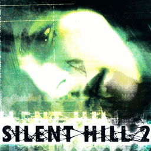

# Silent Hill 2

## PS2 Saves - SLUS20228

| Icon | Filename | Description |
|------|----------|-------------|
|  | [00000001.zip](00000001.zip){: .btn .btn-purple } | BASLUS-20228 FILE-3: SILENT HILL 2File 03 (1_SILENT_HIL_408261.max) |
|  | [00000002.zip](00000002.zip){: .btn .btn-purple } | BASLUS-20228 FILE-3: SILENT HILL 2File 03 (0_Silent_Hil_481610.max) |
|  | [00000003.zip](00000003.zip){: .btn .btn-purple } | BASLUS-20228 FILE-3: SILENT HILL 2File 03 (26879_SILENT_HIL_823376.max) |
|  | [00000004.zip](00000004.zip){: .btn .btn-purple } | BASLUS-20228 GHIT-1: SILENT HILL 2 GHFile 01 (18901_SILENT_HIL_114453.max) |
|  | [00000005.zip](00000005.zip){: .btn .btn-purple } | BASLUS-20228 FILE-3: SILENT HILL 2File 03 (26879_SILENT_HIL_497540.max) |
|  | [00000006.zip](00000006.zip){: .btn .btn-purple } | BASLUS-20228 FILE-2: SILENT HILL 2File 02 (25837_SILENT_HIL_711224.max) |
|  | [00000007.zip](00000007.zip){: .btn .btn-purple } | BASLUS-20228 FILE-1: SILENT HILL 2File 01 (1413_SILENT_HIL_825710.max) |
|  | [00000008.zip](00000008.zip){: .btn .btn-purple } | BASLUS-20228 FILE-3: SILENT HILL 2File 03 (26879_SILENT_HIL_31476.max) |
|  | [00000009.zip](00000009.zip){: .btn .btn-purple } | BASLUS-20228 FILE-1: SILENT HILL 2File 01 (25837_SILENT_HIL_909603.max) |
