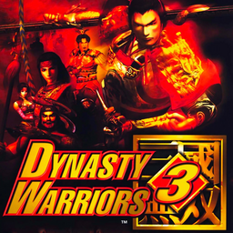

# Dynasty Warriors 3

## PS2 Saves - SLUS20277

| Icon | Filename | Description |
|------|----------|-------------|
|  | [00000001.zip](00000001.zip){: .btn .btn-purple } | BASLUS-20277XXXXXXXX: Dynasty Warriors 3 (5718_Dynasty_Wa_397579.max) |
|  | [00000002.zip](00000002.zip){: .btn .btn-purple } | BASLUS-20277XXXXXXXX: Dynasty Warriors 3 (16163_Dynasty_Wa_812008.max) |
|  | [00000003.zip](00000003.zip){: .btn .btn-purple } | BASLUS-20277XXXXXXXX: Dynasty Warriors 3 (1_Dynasty_Wa_6894.max) |
|  | [00000004.zip](00000004.zip){: .btn .btn-purple } | BASLUS-20277XXXXXXXX: Dynasty Warriors 3 (1_Dynasty_Wa_748318.max) |
|  | [00000005.zip](00000005.zip){: .btn .btn-purple } | BASLUS-20277XXXXXXXX: Dynasty Warriors 3 (1_Dynasty_Wa_727169.max) |
|  | [00000006.zip](00000006.zip){: .btn .btn-purple } | BASLUS-20277XXXXXXXX: Dynasty Warriors 3 (14762_Dynasty_Wa_634075.max) |
