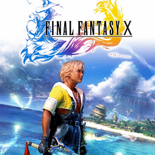

# Final Fantasy X

## PS2 Saves - SLUS20312

| Icon | Filename | Description |
|------|----------|-------------|
|  | [00000001.zip](00000001.zip){: .btn .btn-purple } | BASLUS-20312FF090600: FF10 [01]  71:12Calm-Arena (12596_FF10__01___315014.max) |
|  | [00000002.zip](00000002.zip){: .btn .btn-purple } | BASLUS-20312FF090600: FF10 [01]   0:52Ruins-UnderHall (1_FF10__01___399243.max) |
|  | [00000003.zip](00000003.zip){: .btn .btn-purple } | BASLUS-20312FF090600: FF10 [01] 120:45Calm-Arena (11658_FF10__01___654659.max) |
|  | [00000004.zip](00000004.zip){: .btn .btn-purple } | BASLUS-20312FF090600: FF10 [01]  94:40Omega Ruins (1_FF10__01___137738.max) |
|  | [00000005.zip](00000005.zip){: .btn .btn-purple } | BASLUS-20312FF090601: FF10 [02]   4:05Kilika-Dock (1179_FF10__02___327572.max) |
|  | [00000006.zip](00000006.zip){: .btn .btn-purple } | BASLUS-20312FF090600: FF10 [01]  94:40Omega Ruins (1_FF10__01___598675.max) |
|  | [00000007.zip](00000007.zip){: .btn .btn-purple } | BASLUS-20312FF090600: FF10 [01] 1 0:01Calm-Arena (4365_Final_Fant_38296.max) |
|  | [00000008.zip](00000008.zip){: .btn .btn-purple } | BASLUS-20312FF090600: FF10 [01]   0:32Ruins-UnderHall (1_FF10__01___873104.max) |
|  | [00000009.zip](00000009.zip){: .btn .btn-purple } | BASLUS-20312FF090600: FF10 [01] 125:22Calm-Arena (5217_FF10__01___925976.max) |
|  | [00000010.zip](00000010.zip){: .btn .btn-purple } | BASLUS-20312FF090602: FF10 [03]  14:16Woods-North (1_FF10__03___813854.max) |
|  | [00000011.zip](00000011.zip){: .btn .btn-purple } | BASLUS-20312FF090600: FF10 [01]   0:52Ruins-UnderHall (6690_FF10__01___461010.max) |
|  | [00000012.zip](00000012.zip){: .btn .btn-purple } | BASLUS-20312FF090653: FF10 [54]  26:48Woods-Campsite (2009_FF10_Woods_841823.max) |
|  | [00000013.zip](00000013.zip){: .btn .btn-purple } | BASLUS-20312FF090601: FF10 [02]  89:04Besaid-Road (4535_FF10__02___65274.max) |
|  | [00000014.zip](00000014.zip){: .btn .btn-purple } | BASLUS-20312FF090600: FF10 M01N   0:32Ruins-UnderHall (1_FF10_M01N__988292.max) |
|  | [00000015.zip](00000015.zip){: .btn .btn-purple } | BASLUS-20312FF090601: FF10 [02]  69:11Lake-Crevasse (5487_FF10__02___717098.max) |
|  | [00000016.zip](00000016.zip){: .btn .btn-purple } | BASLUS-20312FF090600: FF10 [01]   0:32Ruins-UnderHall (1_FF10__01___734554.max) |
|  | [00000017.zip](00000017.zip){: .btn .btn-purple } | BASLUS-20312FF090613: FF10 [14]  50:03Airship-Bridge (1_FF10__14___975307.max) |
|  | [00000018.zip](00000018.zip){: .btn .btn-purple } | BASLUS-20312FF090600: FF10 [01]   0:32Ruins-UnderHall (1_FF10__01___493786.max) |
|  | [00000019.zip](00000019.zip){: .btn .btn-purple } | BASLUS-20312FF090600: FF10 M01N   0:32Ruins-UnderHall (1_FF10_M01N__882381.max) |
|  | [00000020.zip](00000020.zip){: .btn .btn-purple } | BASLUS-20312FF090600: FF10 [01]   0:52Ruins-UnderHall (0_Final_Fant_776165.max) |
|  | [00000021.zip](00000021.zip){: .btn .btn-purple } | BASLUS-20312FF090600: FF10 [01]   1:03 (1_FF10__01___857036.max) |
|  | [00000022.zip](00000022.zip){: .btn .btn-purple } | BASLUS-20312FF090600: FF10 [01]   0:59 (1_FF10__01___140484.max) |
|  | [00000023.zip](00000023.zip){: .btn .btn-purple } | BASLUS-20312FF090600: FF10 [01]   0:52Ruins-UnderHall (1_FF10__01___499676.max) |
|  | [00000024.zip](00000024.zip){: .btn .btn-purple } | BASLUS-20312FF090600: FF10 [01]  80:22Omega Ruins (1_FF10__01___755978.max) |
|  | [00000025.zip](00000025.zip){: .btn .btn-purple } | BASLUS-20312FF090601: FF10 [02]  15:36Thunder-South (1329_FF10__02___989071.max) |
|  | [00000026.zip](00000026.zip){: .btn .btn-purple } | BASLUS-20312FF090602: FF10 [03]  78:48Within Sin (1_FF10__03___309018.max) |
|  | [00000027.zip](00000027.zip){: .btn .btn-purple } | BASLUS-20312FF090600: FF10 [01]  94:40Omega Ruins (1_FF10__01___501599.max) |
|  | [00000028.zip](00000028.zip){: .btn .btn-purple } | BASLUS-20312FF090600: FF10 [01]  87:22Airship-Bridge (11183_FF10__01___140439.max) |
|  | [00000029.zip](00000029.zip){: .btn .btn-purple } | BASLUS-20312FF090603: FF10 [04] 216:48Calm-Arena (6424_FF10__04___756222.max) |
|  | [00000030.zip](00000030.zip){: .btn .btn-purple } | BASLUS-20312FF090601: Final Fantasy 10-Within Sin (1_Final_Fant_191128.max) |
|  | [00000031.zip](00000031.zip){: .btn .btn-purple } | BASLUS-20312FF090600: FF10 [01]  93:53Omega Ruins (7729_FF10__01___431362.max) |
|  | [00000032.zip](00000032.zip){: .btn .btn-purple } | BASLUS-20312FF090600: FF10 [01]   0:32Ruins-UnderHall (1_FF10__01___881847.max) |
|  | [00000033.zip](00000033.zip){: .btn .btn-purple } | BASLUS-20312FF090600: FF10 M01N   0:32Ruins-UnderHall (1_FF10_M01N__917583.max) |
|  | [00000034.zip](00000034.zip){: .btn .btn-purple } | BASLUS-20312FF090600: FF10 [01]   0:32Ruins-UnderHall (125_FF10__01___872051.max) |
|  | [00000035.zip](00000035.zip){: .btn .btn-purple } | BASLUS-20312FF090603: FF10 [04] 216:48Calm-Arena (1_FF10__04___479199.max) |
|  | [00000036.zip](00000036.zip){: .btn .btn-purple } | BASLUS-20312FF090602: FF10 [03]  42:32Calm-Arena (9190_FF10__03___74139.max) |
|  | [00000037.zip](00000037.zip){: .btn .btn-purple } | BASLUS-20312FF090601: FF10 [02]  89:35Within Sin (7645_FF10__02___230633.max) |
|  | [00000038.zip](00000038.zip){: .btn .btn-purple } | BASLUS-20312FF090600: FF10 [01]   0:52Ruins-UnderHall (1_FF10__01___524624.max) |
|  | [00000039.zip](00000039.zip){: .btn .btn-purple } | BASLUS-20312FF090600: FF10 [01] 156:04Within Sin (5331_FF10__01___96158.max) |
|  | [00000040.zip](00000040.zip){: .btn .btn-purple } | BASLUS-20312FF090600: FF10 [01]   0:32Ruins-UnderHall (1_FF10__01___728847.max) |
|  | [00000041.zip](00000041.zip){: .btn .btn-purple } | BASLUS-20312FF090600: FF10 [01]  22:45Ruins-UnderHall (1_FF10__01___181332.max) |
|  | [00000042.zip](00000042.zip){: .btn .btn-purple } | BASLUS-20312FF090600: FF10 [01]   0:59 (1_FF10__01___565518.max) |
|  | [00000043.zip](00000043.zip){: .btn .btn-purple } | BASLUS-20312FF090601: FF10 [02]  62:02Within Sin (1224_FF10__02___55432.max) |
|  | [00000044.zip](00000044.zip){: .btn .btn-purple } | BASLUS-20312FF090600: FF10 [01]   0:52Ruins-UnderHall (1_FF10__01___56119.max) |
|  | [00000045.zip](00000045.zip){: .btn .btn-purple } | BASLUS-20312FF090602: FF10 [03]   3:39Luca-Before Gam (5535_FF10__03___494549.max) |
|  | [00000046.zip](00000046.zip){: .btn .btn-purple } | BASLUS-20312FF090600: FF10 [01]   0:52Ruins-UnderHall (1_FF10__01___718410.max) |
|  | [00000047.zip](00000047.zip){: .btn .btn-purple } | BASLUS-20312FF090602: FF10 [03] 117:38Woods-South (4365_Final_Fant_385449.max) |
|  | [00000048.zip](00000048.zip){: .btn .btn-purple } | BASLUS-20312FF090600: FF10 complete (1_FF10_compl_519207.max) |
