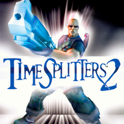

# TimeSplitters 2

## PS2 Saves - SLUS20314

| Icon | Filename | Description |
|------|----------|-------------|
|  | [00000001.zip](00000001.zip){: .btn .btn-purple } | BASLUS-20314-TS2-OPT: TimeSplitters 2(Game Settings) (15469_TimeSplitt_992565.max) |
|  | [00000002.zip](00000002.zip){: .btn .btn-purple } | BASLUS-20314-TS2-MAP: TimeSplitters 2(Saved Maps) (135_TimeSplitt_992839.max) |
|  | [00000003.zip](00000003.zip){: .btn .btn-purple } | BASLUS-20314-TS2-OPT: TimeSplitters 2(Game Settings) (1_TimeSplitt_122281.max) |
|  | [00000004.zip](00000004.zip){: .btn .btn-purple } | BASLUS-20314-TS2-MAP: TimeSplitters 2(Saved Maps) (11477_TimeSplitt_236096.max) |
|  | [00000005.zip](00000005.zip){: .btn .btn-purple } | BASLUS-20314-TS2-OPT: TimeSplitters 2(Game Settings) (6626_TimeSplitt_767193.max) |
