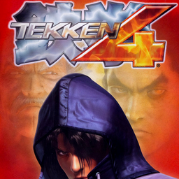

# Tekken 4

## PS2 Saves - SLUS20328

| Icon | Filename | Description |
|------|----------|-------------|
|  | [00000001.zip](00000001.zip){: .btn .btn-purple } | BASLUS-20328Tekken-4: TEKKEN 4 (1_TEKKEN_4_913677.max) |
|  | [00000002.zip](00000002.zip){: .btn .btn-purple } | BASLUS-20328Tekken-4: TEKKEN 4 (2715_TEKKEN_4_W_228940.max) |
|  | [00000003.zip](00000003.zip){: .btn .btn-purple } | BASLUS-20328Tekken-4: TEKKEN 4 (7969_TEKKEN_4_947551.max) |
|  | [00000004.zip](00000004.zip){: .btn .btn-purple } | BASLUS-20328Tekken-4: TEKKEN 4 (4717_TEKKEN_4_627560.max) |
|  | [00000005.zip](00000005.zip){: .btn .btn-purple } | BASLUS-20328Tekken-4: TEKKEN 4 (896_TEKKEN_4_782070.max) |
|  | [00000006.zip](00000006.zip){: .btn .btn-purple } | BASLUS-20328Tekken-4: TEKKEN 4 (102_TEKKEN_4_39502.max) |
|  | [00000007.zip](00000007.zip){: .btn .btn-purple } | BASLUS-20328Tekken-4: TEKKEN 4 (1_TEKKEN_4_426129.max) |
|  | [00000100.zip](00000100.zip){: .btn .btn-purple } | Lots Unlocked. All Stages, All Characters, Theatre Mode and All Movies unlocked |
