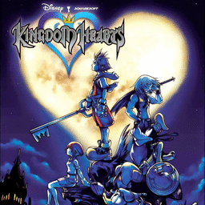

# Kingdom Hearts

## PS2 Saves - SLUS20370

| Icon | Filename | Description |
|------|----------|-------------|
|  | [00000001.zip](00000001.zip){: .btn .btn-purple } | BASLUS-20370-01: KINGDOMHEARTS/01Final Rest (18872_KINGDOMHEA_420223.max) |
|  | [00000002.zip](00000002.zip){: .btn .btn-purple } | BASLUS-20370-03: KINGDOMHEARTS (10988_KINGDOMHEA_745739.max) |
|  | [00000003.zip](00000003.zip){: .btn .btn-purple } | BASLUS-20370-01: KINGDOMHEARTS/01Tranquil Grotto (20347_KINGDOMHEA_311734.max) |
|  | [00000004.zip](00000004.zip){: .btn .btn-purple } | BASLUS-20370-01: KINGDOMHEARTS (15469_KINGDOMHEA_934322.max) |
|  | [00000005.zip](00000005.zip){: .btn .btn-purple } | BASLUS-20370-01: KINGDOMHEARTS/01Accessory Shop (24327_KINGDOMHEA_872387.max) |
|  | [00000006.zip](00000006.zip){: .btn .btn-purple } | BASLUS-20370-01: KINGDOMHEARTS/01Tranquil Grotto (21677_KINGDOMHEA_451092.max) |
