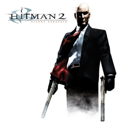

# Hitman 2: Silent Assassin

## PS2 Saves - SLUS20374

| Icon | Filename | Description |
|------|----------|-------------|
|  | [00000001.zip](00000001.zip){: .btn .btn-purple } | BASLUS-20374_1: Hitman 212/24 10:02:23 (1_Hitman_212_144040.max) |
|  | [00000002.zip](00000002.zip){: .btn .btn-purple } | BASLUS-20374_2: Hitman2 (1_Hitman2_546932.max) |
|  | [00000003.zip](00000003.zip){: .btn .btn-purple } | BASLUS-20374_3: Hitman 212/1 09:07:10 (1093_Hitman_2_1_524655.max) |
|  | [00000004.zip](00000004.zip){: .btn .btn-purple } | BASLUS-20374_2: Hitman2 (1_Hitman2_693127.max) |
|  | [00000005.zip](00000005.zip){: .btn .btn-purple } | BASLUS-20374_1: Hitman 212/24 10:02:23 (1_Hitman_212_269482.max) |
|  | [00000006.zip](00000006.zip){: .btn .btn-purple } | BASLUS-20374_2: Hitman 210/11 17:03:35 (1_Hitman_210_897640.max) |
|  | [00000007.zip](00000007.zip){: .btn .btn-purple } | BASLUS-20374_1: Hitman 212/24 10:02:23 (1_Hitman_212_51495.max) |
