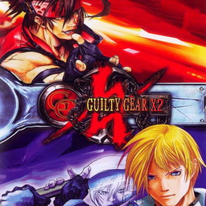

# Guilty Gear X2

## PS2 Saves - SLUS20436

| Icon | Filename | Description |
|------|----------|-------------|
|  | [00000001.zip](00000001.zip){: .btn .btn-purple } | BASLUS-20436GGXX: Guilty Gear X2System Data (5339_Guilty_Gea_915096.max) |
|  | [00000002.zip](00000002.zip){: .btn .btn-purple } | BASLUS-20436GGXX: Guilty Gear X2System Data (1_Guilty_Gea_279156.max) |
|  | [00000100.zip](00000100.zip){: .btn .btn-purple } | All Complete. Mission Mode, Arcade Mode and Story Mode |
