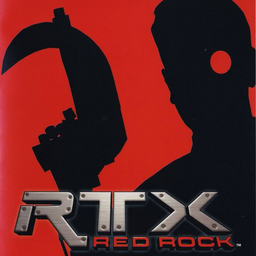

# RTX: Red Rock

## PS2 Saves - SLUS20491

| Icon | Filename | Description |
|------|----------|-------------|
|  | [00000001.zip](00000001.zip){: .btn .btn-purple } | BASLUS-20491: RTX Red Rock (1_RTX_Red_Ro_570294.max) |
|  | [00000002.zip](00000002.zip){: .btn .btn-purple } | BASLUS-20491: RTX Red Rock (1388_RTX_Red_Ro_997081.max) |
|  | [00000003.zip](00000003.zip){: .btn .btn-purple } | BASLUS-20491: RTX Red Rock (1_RTX_Red_Ro_738110.max) |
|  | [00000004.zip](00000004.zip){: .btn .btn-purple } | BASLUS-20491: RTX Red Rock (1_RTX_Red_Ro_195035.max) |
|  | [00000100.zip](00000100.zip){: .btn .btn-purple } | All Levels And Bonus Material. |
