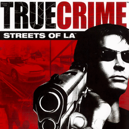

# True Crime: Streets of LA

## PS2 Saves - SLUS20550

| Icon | Filename | Description |
|------|----------|-------------|
|  | [00000001.zip](00000001.zip){: .btn .btn-purple } | BASLUS-20550TC: True Crime:Streets of LA (1_True_Crime_187451.max) |
|  | [00000002.zip](00000002.zip){: .btn .btn-purple } | BASLUS-20550TC: True Crime:Streets of LA (1_True_Crime_695583.max) |
|  | [00000003.zip](00000003.zip){: .btn .btn-purple } | BASLUS-20550TC: True Crime:Streets of LA (13142_True_Crime_732250.max) |
|  | [00000004.zip](00000004.zip){: .btn .btn-purple } | BASLUS-20550TC: True Crime:Streets of LA (8331_True_Crime_135144.max) |
|  | [00000005.zip](00000005.zip){: .btn .btn-purple } | BASLUS-20550TC: True Crime:Streets of LA (1_True_Crime_314389.max) |
|  | [00000006.zip](00000006.zip){: .btn .btn-purple } | BASLUS-20550TC: True Crime:Streets of LA (5097_True_Crime_436856.max) |
|  | [00000007.zip](00000007.zip){: .btn .btn-purple } | BASLUS-20550TC: True Crime:Streets of LA (1_True_Crime_495907.max) |
|  | [00000008.zip](00000008.zip){: .btn .btn-purple } | BASLUS-20550TC: True Crime:Streets of LA (1_True_Crime_884670.max) |
