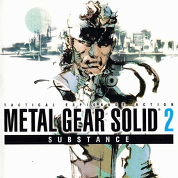

# Metal Gear Solid 2: Substance

## PS2 Saves - SLUS20554

| Icon | Filename | Description |
|------|----------|-------------|
|  | [00000001.zip](00000001.zip){: .btn .btn-purple } | BASLUS-20554000G000: MGS2S 00/01:17Sh.1Core B1Hall (3547_MGS2S_00_0_342068.max) |
|  | [00000002.zip](00000002.zip){: .btn .btn-purple } | BASLUS-20554000G000: MGS2S 00/01:22Tanker Cleared (9974_MGS2S_00_0_489132.max) |
|  | [00000003.zip](00000003.zip){: .btn .btn-purple } | BASLUS-20554000S000: MGS2S SnakeTales00/E (2392_MGS2S_Snak_557125.max) |
|  | [00000004.zip](00000004.zip){: .btn .btn-purple } | BASLUS-20554000P010: MGS2S Photo DataPHOTO 011 (26971_MGS2S_Phot_640133.max) |
|  | [00000005.zip](00000005.zip){: .btn .btn-purple } | BASLUS-20554000P001: MGS2S Photo DataBOXERS    (5812_MGS2S_Phot_348553.max) |
|  | [00000006.zip](00000006.zip){: .btn .btn-purple } | BASLUS-20554000G000: MGS2S 00/00:32Deck-D quarters (5563_Metal_Gear_228650.max) |
|  | [00000007.zip](00000007.zip){: .btn .btn-purple } | BASLUS-20554000G000: MGS2S 00/08:10Federal Hall (1_MGS2S_00_0_56042.max) |
|  | [00000008.zip](00000008.zip){: .btn .btn-purple } | BASLUS-20554000G009: MGS2S 09/08:27Plant Cleared (1_MGS2S_09_0_865581.max) |
|  | [00000009.zip](00000009.zip){: .btn .btn-purple } | BASLUS-20554000G009: MGS2S 09/10:50Plant Cleared (25844_MGS2S_09_1_471417.max) |
|  | [00000010.zip](00000010.zip){: .btn .btn-purple } | BASLUS-20554000P011: MGS2S Photo DataPHOTO 012 (26971_MGS2S_Phot_833904.max) |
|  | [00000011.zip](00000011.zip){: .btn .btn-purple } | BASLUS-20554000G009: MGS2S 09/08:33Plant Cleared (1_MGS2S_09_0_94571.max) |
|  | [00000012.zip](00000012.zip){: .btn .btn-purple } | BASLUS-20554000G001: MGS2S 01/07:33AG-Rectum (1_MGS2S_01_0_788769.max) |
|  | [00000013.zip](00000013.zip){: .btn .btn-purple } | BASLUS-20554000V000: MGS2S Missions100.0% (14250_MGS2S_Miss_321026.max) |
|  | [00000014.zip](00000014.zip){: .btn .btn-purple } | BASLUS-20554000V000: MGS2S Missions100.0% (2392_MGS2S_Miss_692852.max) |
|  | [00000015.zip](00000015.zip){: .btn .btn-purple } | BASLUS-20554000G000: MGS2S 00/05:51Plant Cleared (1_MGS2S_00_0_109006.max) |
|  | [00000016.zip](00000016.zip){: .btn .btn-purple } | BASLUS-20554000G000: MGS2S 00/01:18Strut E ParcelRm (3362_MGS2S_00_0_164914.max) |
