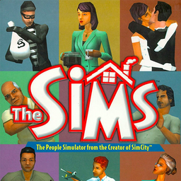

# The Sims

## PS2 Saves - SLUS20573

| Icon | Filename | Description |
|------|----------|-------------|
|  | [00000001.zip](00000001.zip){: .btn .btn-purple } | BASLUS-20573NdlkMmND: Sims save YPSI (2927_YPSI_21634.max) |
|  | [00000002.zip](00000002.zip){: .btn .btn-purple } | BASLUS-20573SgdmHALA: Sims life ROCK (1_Sims_life__663647.max) |
|  | [00000100.zip](00000100.zip){: .btn .btn-purple } | Party Motel And Play The SIMs Unlocked. |
